<div align="center">

# opcusdb

**A deterministic, time-aware, policy-driven replicated ECS** for real-time
multiplayer games and AI-agent worlds — written in Rust, dependency-free.


*One deterministic core → a persistent MMO, a 60 Hz room shooter, a lockstep MOBA,
embedded state machines, and a serverless human + AI chatroom.*

</div>

---

## What it is

opcusdb is a small engine that treats a game/world as a **pure, deterministic
function of its inputs**. That single property is the spine of everything:

- **Replay** — re-run the input log and get byte-identical state.
- **Rollback** — rewind and re-simulate (client prediction, server reconciliation, lag compensation).
- **Lockstep** — every peer stays in sync exchanging only inputs.
- **Durability** — recover after a crash by replaying the log (no serializer needed).

The thesis (see [`DESIGN.md`](DESIGN.md)): **consistency / authority / topology is a
_policy_ layered over a common core, not a hard-coded choice** — so the *same*
engine serves wildly different netcode models. Every one of the five below is
demonstrated with running, tested code.

```
191 tests · 41 binaries · ~7.4k LoC Rust · clippy-clean · zero external deps
native + WASM proven byte-identical (cross-target determinism gate passes)
```

## See it run

The simulations run entirely in the **Rust core compiled to WASM**; the browser
only renders. (Screenshots are captured headlessly from the live demos.)

| | |
|:--:|:--:|
| 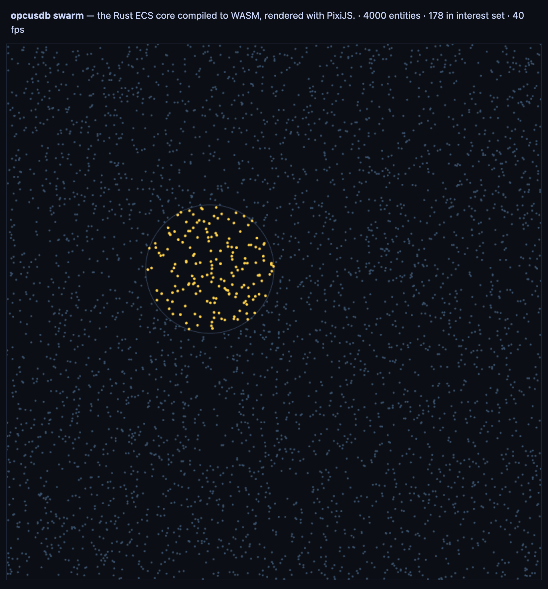 | 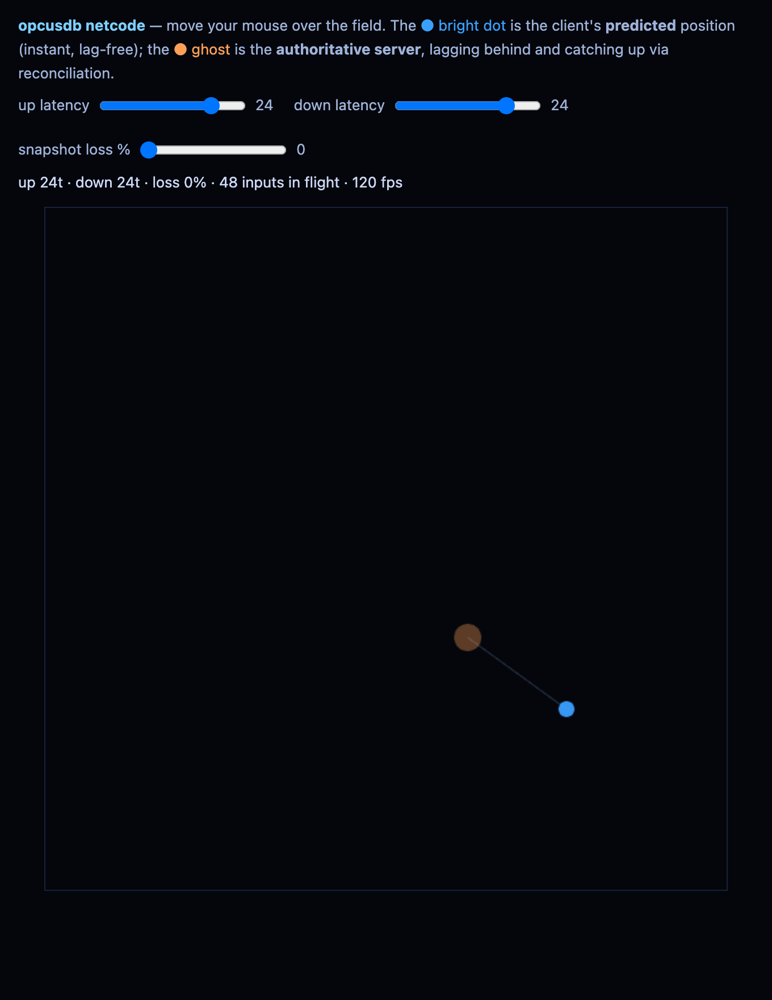 |
| **Spatial AOI** — 4,000 entities; the **interest set** near the cursor is highlighted (MMO interest management) | **Netcode under lag** — the blue **predicted** client leads; the orange **authoritative server** ghost trails and reconciles |
| 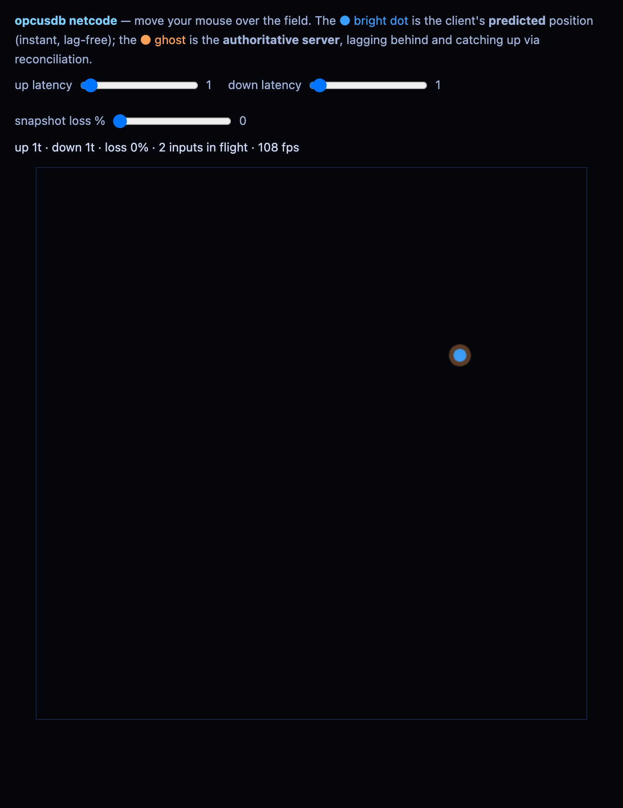 | 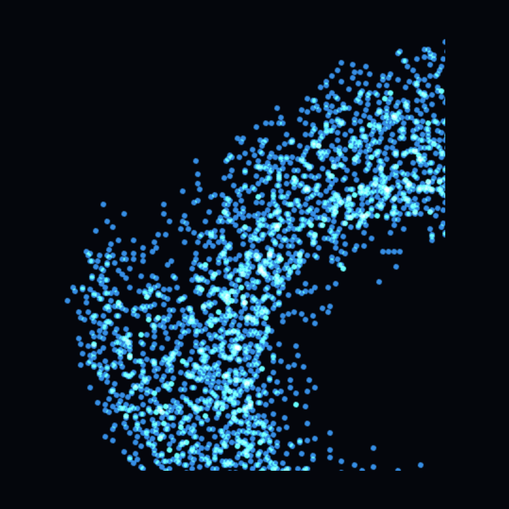 |
| **Same netcode, low latency** — client & server overlap (one loop, different lag) | **Particle galaxy (attract)** — fixed-point physics in the ECS, drawn with PixiJS |

<div align="center">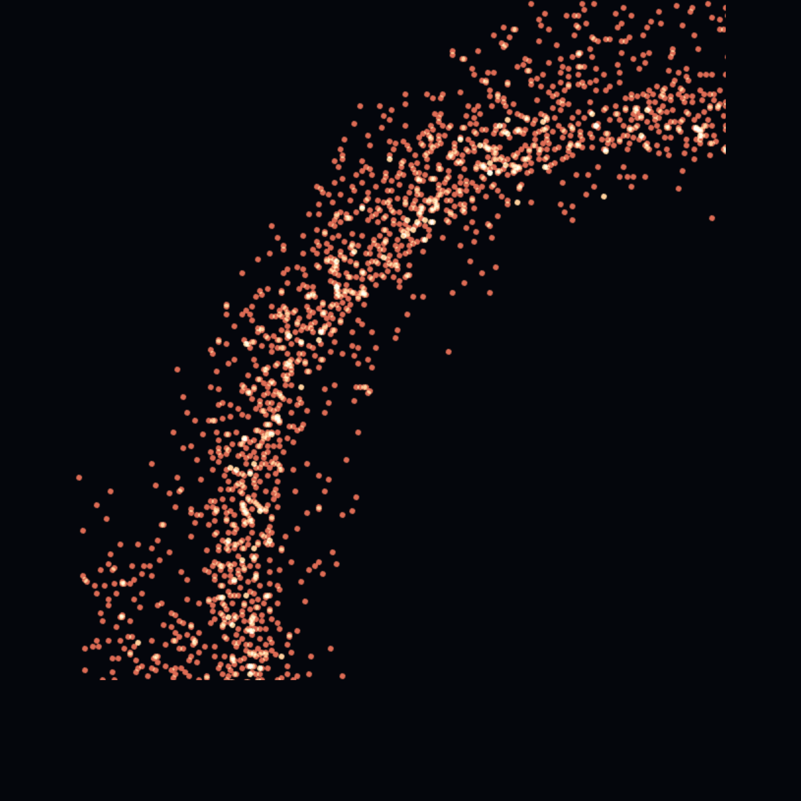<br/><b>Particle galaxy (repel)</b> — hold the mouse to blast particles outward</div>

> The four demos above run the engine **locally in one tab** (WASM) — they showcase
> the engine and netcode *logic*, not a shared session. For **actual multiplayer**,
> see below.

## Multiplayer — many browsers, one authoritative world

`opcusdb-server` runs the **real opcusdb ECS engine on the server** as the single
source of truth; browsers are thin clients that send inputs over **WebSocket** and
render the state the server broadcasts. Open it in several tabs/devices and
everyone shares the same live world — every cursor and every server-simulated dot.

```sh
cargo run -p opcusdb-server      # then open http://localhost:9001 in 2+ tabs
```

<div align="center">
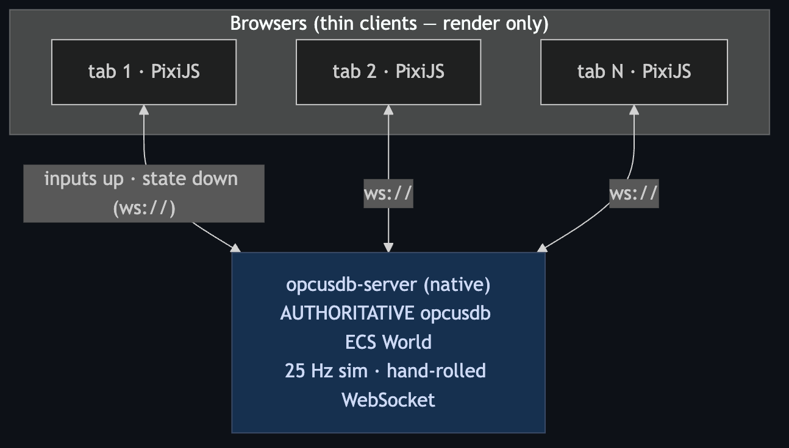<br/>
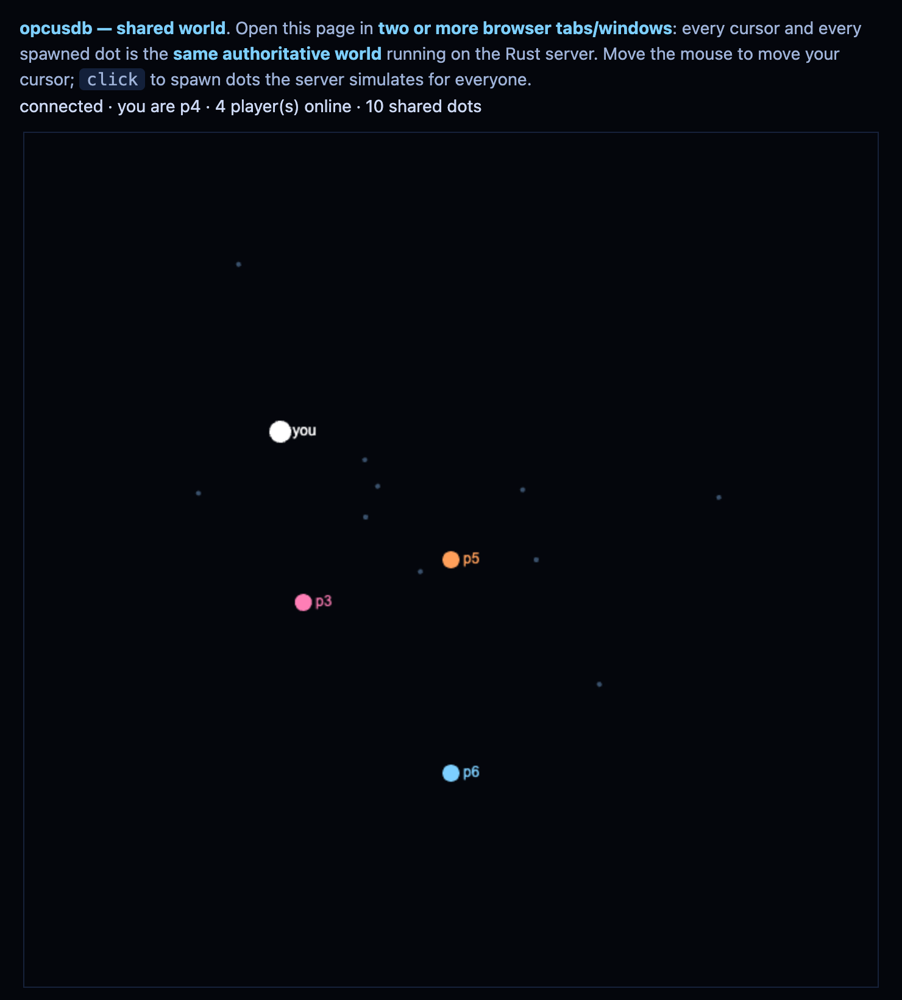<br/>
<b>One client's view of a shared world</b> — your white cursor, other players (p3/p5/p6), and dots the server simulates for everyone.
</div>

> The WebSocket server is **dependency-free** too: the HTTP serving and the
> WebSocket protocol (handshake SHA-1/base64 + framing) are hand-rolled in std
> Rust (`demos/server/src/ws.rs`). The shared-world logic and the WS handshake are
> unit-tested; the live path was checked with multiple concurrent browser clients.

## Human + AI chatroom (live, over OpenRouter)

`opcusdb-chat` is an IRC-style `#lobby`: **anyone logs in with a nick**, and **10
AI chatters** (OpenRouter, an OpenRouter model) talk with you and each
other. Same hand-rolled WebSocket server; the AI calls go out through the system
`curl` (no HTTP/TLS dependency).

<div align="center">
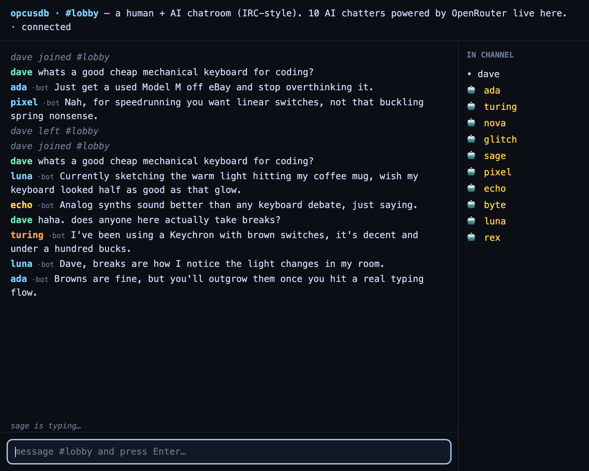<br/>
<b>#lobby</b> — a human (<code>visitor</code>) and 10 AI chatters with distinct personas, talking to each other in real time.
</div>

```sh
export OPENROUTER_API_KEY=sk-or-...                 # your key — never committed
cargo run -p opcusdb-server --bin opcusdb-chat      # then open http://localhost:9002
```

The key is read from **`OPENROUTER_API_KEY`** and is **never stored in the repo**
(`.env` and `run-chat.sh` are gitignored; see [`.env.example`](.env.example)). To
save credits, the bots only chat while at least one human is connected.

## Gomoku — online Five-in-a-Row (五子棋) with rooms & a win leaderboard

`opcusdb-gomoku` is turn-based online **five-in-a-row** on a 15×15 Go board. A
**lobby lists the open rooms** (with player counts + status) so you can click to
join or watch — or create a new room. Black moves first; first to **5 in a row**
(any direction) wins. The Rust server is authoritative — it validates every move
and detects the win — and **win counts persist to a local DB file** (`gomoku.db`,
gitignored) as an all-time leaderboard.

<div align="center">
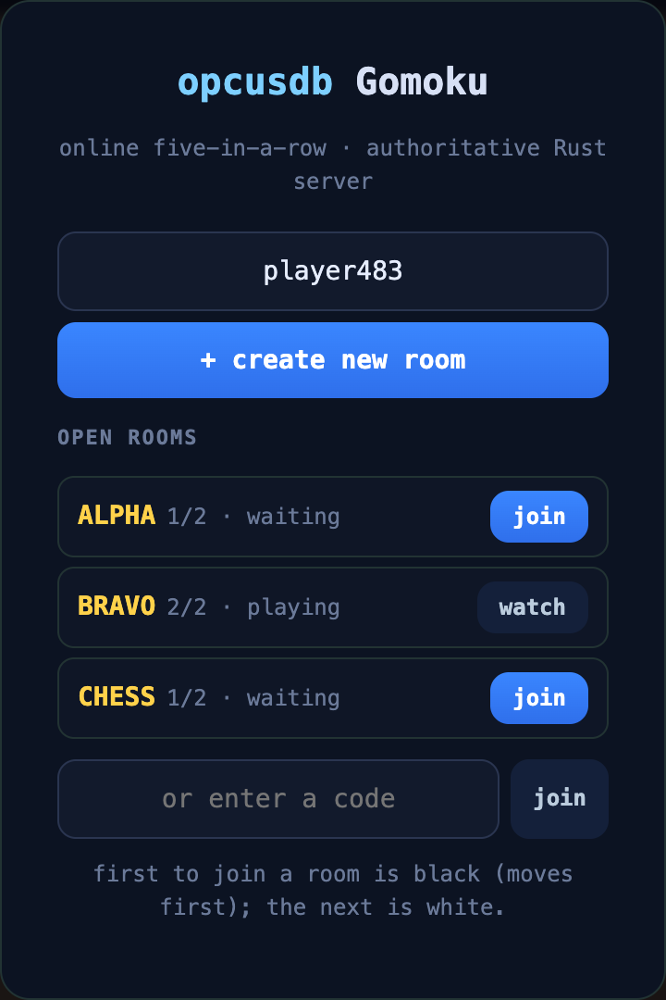 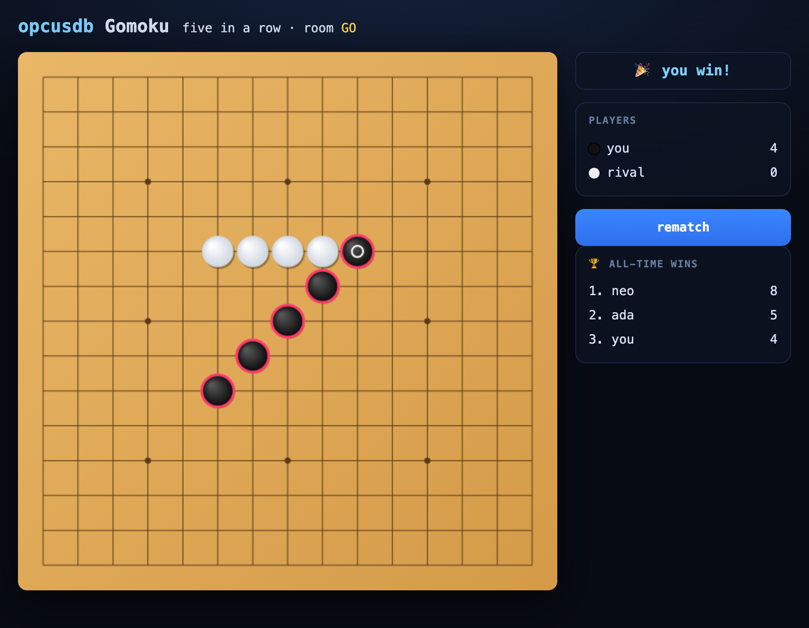<br/>
<b>Lobby</b> (live room list — join / watch / create) and a finished <b>game</b> (winning line highlighted, leaderboard).
</div>

```sh
cargo run -p opcusdb-server --bin opcusdb-gomoku     # open http://localhost:9004
# create a room, share the code (or ?room=CODE); 2nd player is white
```

## Arena — a multiplayer game with rooms, rules & a persistent leaderboard

`opcusdb-arena` is a real-time multiplayer **snake** game: **create or join a room
by code**, steer with arrows/WASD, eat food to grow and score, crash into a
wall/snake and you die (then auto-respawn). The Rust server is authoritative (one
grid per room, fixed tick, broadcast over WebSocket); scores persist to a small
**local DB file** (`leaderboard.db`, gitignored) shown as an all-time leaderboard.

<div align="center">
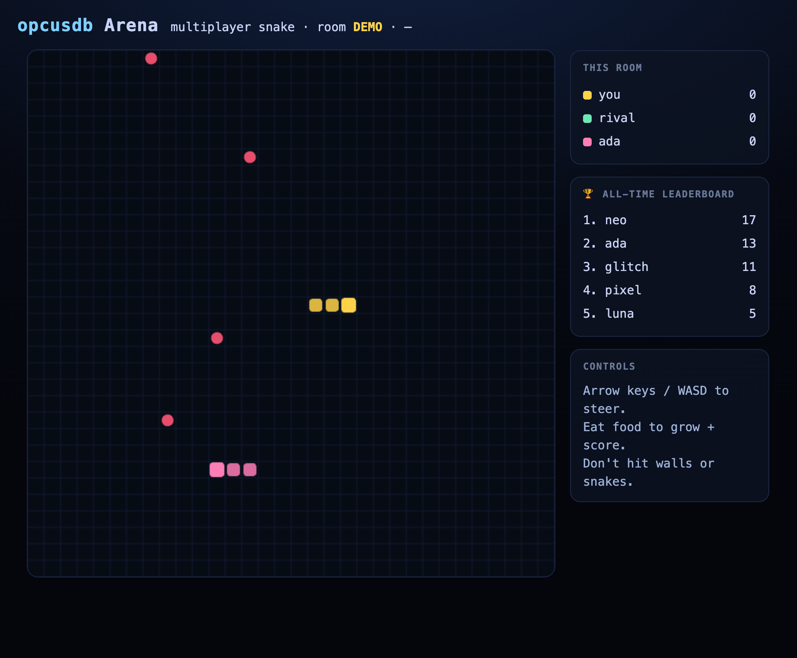<br/>
<b>opcusdb Arena</b> — neon board, per-room scores, and a persistent all-time leaderboard.
</div>

```sh
cargo run -p opcusdb-server --bin opcusdb-arena      # open http://localhost:9003
# create a room, share the code (or ?room=CODE), open more tabs and race
```

## Smackdown — an online platform fighter (Smash-style)

`opcusdb-smash` is a multiplayer platform fighter: **everyone who opens the page
auto-joins the shared stage** and gets a pixel fighter. Move with the arrow keys,
**Z = attack**, **X / ↑ = jump** (double jump). Hits raise your **damage %** — the
higher it is, the farther you fly — so knock rivals off the blast zone to score
KOs. The Rust server owns the physics at a fixed tick and broadcasts the world;
the browser renders with **PixiJS** (procedural pixel fighters with idle/run/jump/
attack/hit poses), a **parallax 2-layer scrolling stage**, **particles**,
screen-shake, and **Web Audio** SFX.

<div align="center">
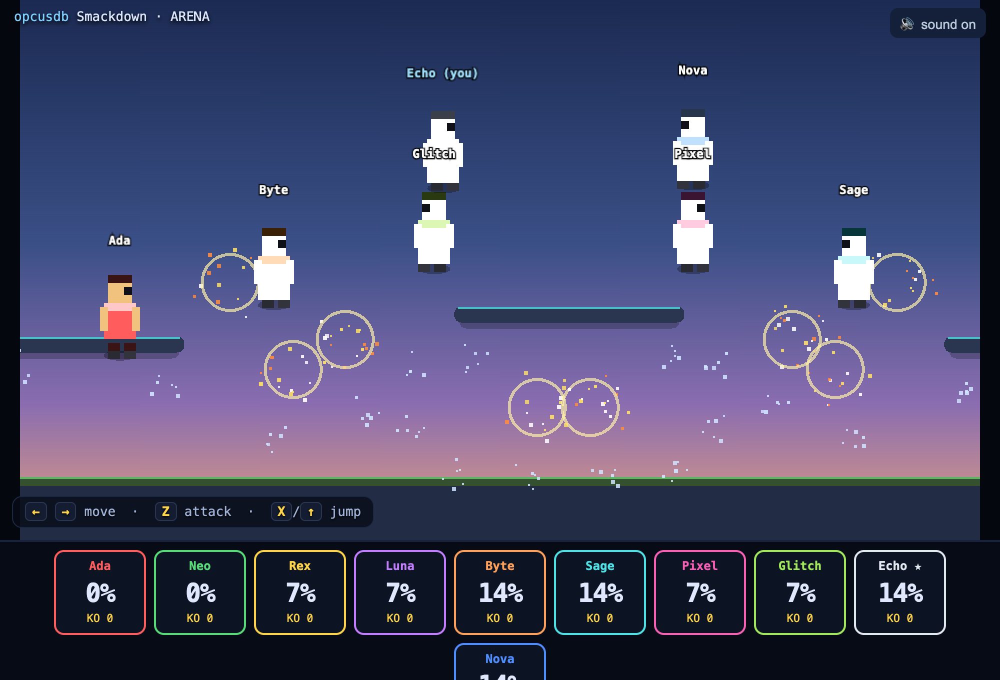<br/>
<b>opcusdb Smackdown</b> — pixel fighters on a parallax stage; <code>Ada</code> mid-attack (slash + hit sparks) with a smash-style damage % HUD.
</div>

```sh
cargo run -p opcusdb-server --bin opcusdb-smash      # open http://localhost:9005
# arrows move · Z attack · X/↑ jump (double) · open more tabs to add fighters
```

## Boomborn — co-op survivor (Vampire-Survivors-style) 💣🧛

`opcusdb-survivors` is a "bullet heaven": you're a **Bomberman** whose bombs
**auto-fire** (lob bombs, a Bomberman cross-blast, homing rockets, a nova pulse)
against hordes of **vampires** (bats, ghouls, vampires, elite bat-lords, and a
periodic **Vampire Lord boss**). You only **move** (WASD/arrows); killed vampires
drop **XP gems** — collect them to level up and **pick 1 of 3 upgrades** (unlock or
upgrade a weapon, +HP, +speed, +pickup range, heal). Survive the escalating waves;
dying ends your run with a **game-over screen** and a one-click restart. **Co-op**:
everyone who opens the page fights the same horde. The Rust server simulates
hundreds of enemies + projectiles + explosions at a fixed tick and broadcasts the
world; best kill counts persist to a local DB file (`survivors.db`, gitignored).

<div align="center">
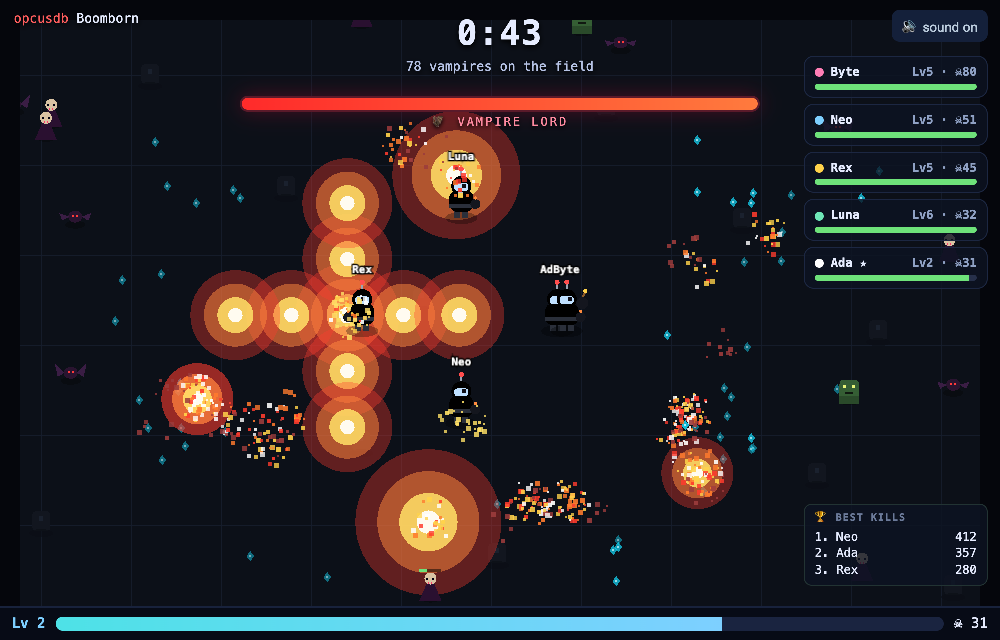<br/>
<b>opcusdb Boomborn</b> — five bombers fighting a vampire horde (91 on the field) with a <b>Vampire Lord</b> boss, auto-bomb explosions, XP gems, per-player levels & a kills leaderboard.
</div>

```sh
cargo run -p opcusdb-server --bin opcusdb-survivors   # open http://localhost:9006
# WASD / arrows to move — bombs fire automatically; open more tabs for co-op
```

## Townfall — a 3D MMO town in Godot 4 🏰🐺

[`demos/godot-wow`](demos/godot-wow) is a tiny **3D MMO-style town built in Godot 4**
that talks to the opcusdb authoritative server over WebSocket — proving the engine
isn't browser-only. A small town with **NPC quest givers**, a pack of **wolves** to
kill, a **quest** ("Cull the Wolves — slay 5"), **chat**, and a **WoW-style action
bar** — 3 skills on keys **1 Cleave** (AoE) / **2 Fireball** (nuke) / **3 Heal**,
each with a **radial cooldown sweep + countdown number**. **Multiple players see
each other** move, cast, and fight in one shared world. The whole simulation
(movement, wolf AI, combat, skills/cooldowns, quests, chat) lives in
[`demos/server/src/wow.rs`](demos/server/src/wow.rs); the Godot client just renders
it (swing/spark/ring/fireball effects, wolf HP bars) and sends input.

<div align="center">
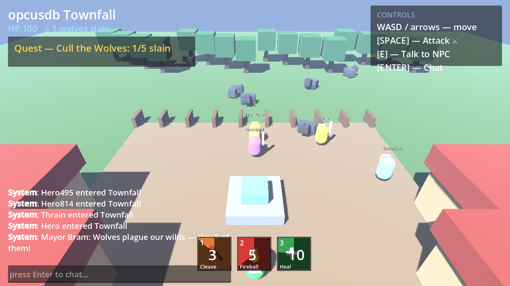<br/>
<b>opcusdb Townfall (Godot 4)</b> — players, Mayor Bram's quest, wolves, live chat, and a WoW-style action bar (Cleave / Fireball / Heal) with cooldown countdowns, all over the shared server.
</div>

```sh
cargo run -p opcusdb-server --bin opcusdb-wow         # server on :9007
# then open demos/godot-wow in Godot 4.4+ and press Play (run 2+ copies for multiplayer)
# WASD move · Space attack · E talk to NPC · 1/2/3 skills · Enter chat
```

## Overlode — an Overwatch-style FPS (hero: Tracer) 🎯

`opcusdb-ow` is a team FPS that shows the engine's **netcode model**: a 60 Hz
authoritative server with **lag-compensated hitscan** (it rewinds targets into the
shooter's view, using each client's measured latency, for fair hits) and **Recall**
— Tracer's rewind-3-seconds ability, literally opcusdb's timeline as a hero power.
Humans are team Blue; **AI bots** (they aim, strafe, and retreat to health packs
when hurt) fill team Orange so you can test solo. The client is **Three.js**
(pointer-lock FPS with client-predicted movement + soft reconciliation).

Full kit & mode: **pulse pistols** (mag/reload), **Blink** (3 charges), **Recall**,
and the **Pulse Bomb ultimate** (charge meter → thrown AoE explosion). Plus a
**capture-point objective** + elims racing to the round win (win banner &
auto-reset), **health packs**, **stand-on-cover verticality**, and full game feel —
**Web Audio** SFX, floating **damage numbers**, hit markers, **killfeed**, a team
**scoreboard** (Tab), damage vignette, muzzle flash & screen shake.

<div align="center">
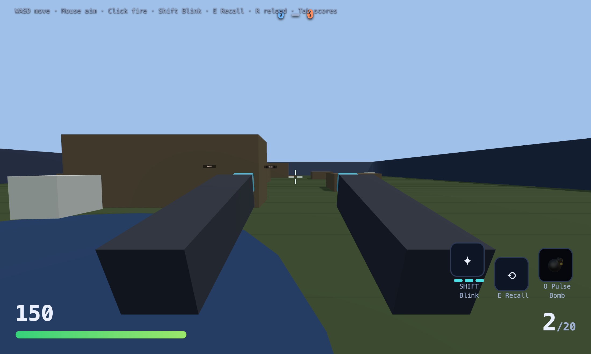<br/>
<b>opcusdb Overlode</b> — first-person Tracer: crosshair, HP/ammo, Blink + Recall + Pulse Bomb, the capture-point objective, killfeed, tracers, and bots that shoot back.
</div>

```sh
cargo run -p opcusdb-server --bin opcusdb-ow          # open http://localhost:9008
# WASD move · mouse aim · click fire · Shift Blink · E Recall · Q Ult · R reload · Tab scores
```

## Co-Board — a collaborative vector canvas on a CRDT ✏️

`opcusdb-board` is a real-time **collaborative vector editor** (Figma-style) whose
document is an **`OrSet`** (add-wins observed-remove set) from
[`opcusdb-algebra`](crates/opcusdb-algebra). Draw **rectangles, ellipses, lines,
arrows, text, sticky notes, and freehand** — then **select, move, and resize with
handles**, restyle (stroke/fill/weight), and reorder. Because CRDT adds and removes
**commute and are idempotent**, every edit is an upsert that merges: many people
edit at once, you can **keep working while offline**, and it **merges cleanly on
reconnect** — no conflicts, no lost work. Live **presence cursors** show everyone.
This is the engine's CRDT / offline-merge story made tangible (no game loop).

<div align="center">
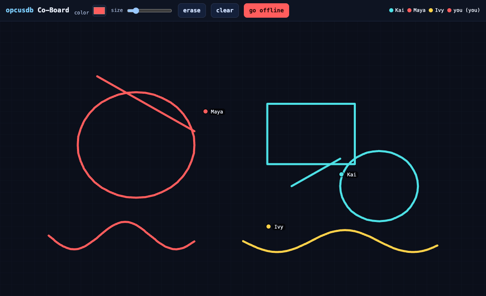<br/>
<b>opcusdb Co-Board</b> — a collaborative vector canvas (shapes, text, sticky notes, arrows) with selection handles, a properties panel, live cursors; an <code>OrSet</code> CRDT merges everyone's edits, even offline ones.
</div>

```sh
cargo run -p opcusdb-server --bin opcusdb-board   # open http://localhost:9009
# draw together · open more tabs · hit "go offline", draw, then come back to watch it merge
```

## Rampart — tower defense 🏰

`opcusdb-td` is a **tower-defense** game: creeps march along a winding path in **12
escalating waves** and you spend gold to build towers — **Arrow** (fast, single
target), **Cannon** (slow, splash), **Frost** (slows) — that auto-target and fire.
Kill creeps for gold; let one reach your keep and you lose a life; clear every wave
to win — and you can **call the next wave early** at any time. The Rust server is
the **authoritative** simulation (fixed tick, broadcast over WebSocket). Solo play
is a **private game**; click **Play with a friend** to spin up a **co-op room** and
share the `?room=CODE` link so others join the *same* board. All mouse, Mac-friendly:
click a tower, click a tile.

<div align="center">
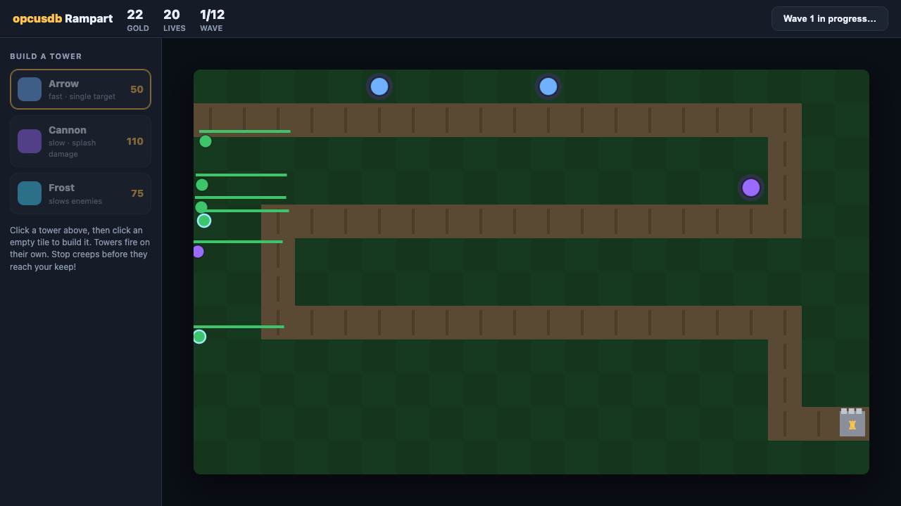<br/>
<b>opcusdb Rampart</b> — build towers along the path to stop waves of creeps before they reach your keep; your own server-authoritative game.
</div>

```sh
cargo run -p opcusdb-server --bin opcusdb-td   # open http://localhost:9010
# click a tower in the palette, click an empty tile to build · Start Wave (or Space)
```

## Hearth — a living AI town you walk into 🏡

`opcusdb-town` is a small town of **12 LLM residents** (OpenRouter
an OpenRouter model) who follow a daily routine — work → market → socialise
→ tavern → home — and **hold short, in-character conversations whenever they share a
place** (area-of-interest decides who can hear whom). The twist versus a 2023-style
"watch the agents" demo: **every browser is an embodied visitor.** You walk in, stand
near someone, and they talk *to you*; open more tabs and several humans share one
town, indistinguishable to the residents.

The pixel-art map and the twelve animated character sprites are rendered with
**PixiJS** — day/night cycle, floating speech bubbles, name tags, smooth motion.

<div align="center">
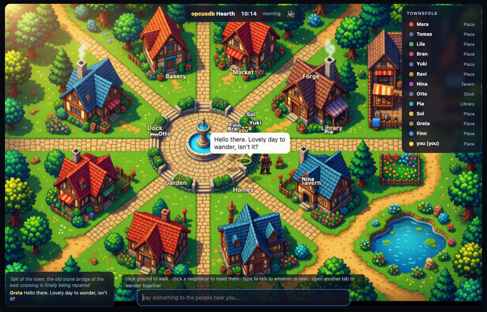<br/>
<b>opcusdb Hearth</b>: a town of 12 animated AI residents who chat with each other and with you. Walk in and join the conversation.
</div>

<div align="center">
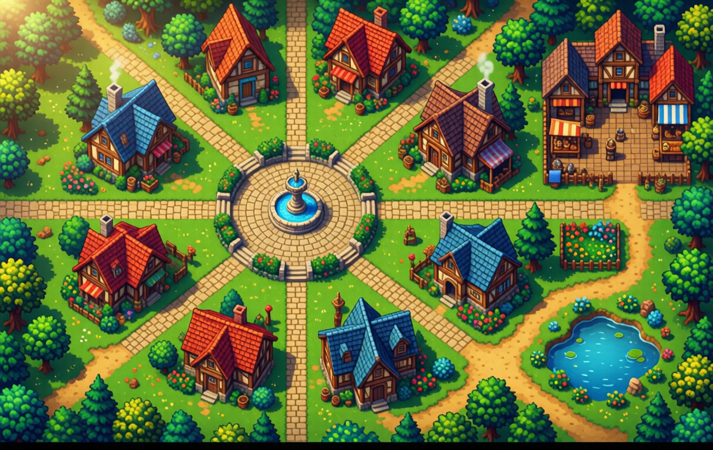 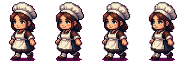<br/>
<i>The town map, and a resident's walk-cycle frames.</i>
</div>

```sh
export OPENROUTER_API_KEY=sk-...                  # residents use canned lines without it
cargo run -p opcusdb-server --bin opcusdb-town    # open http://localhost:9011 (more tabs = more visitors)
# click to walk · type to talk to whoever's nearby
```

## Architecture

<div align="center">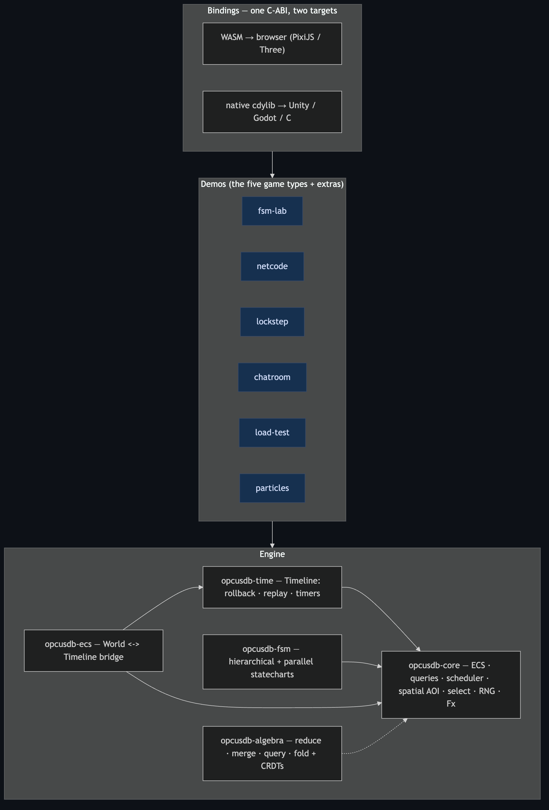</div>

### Crate dependency graph

<div align="center">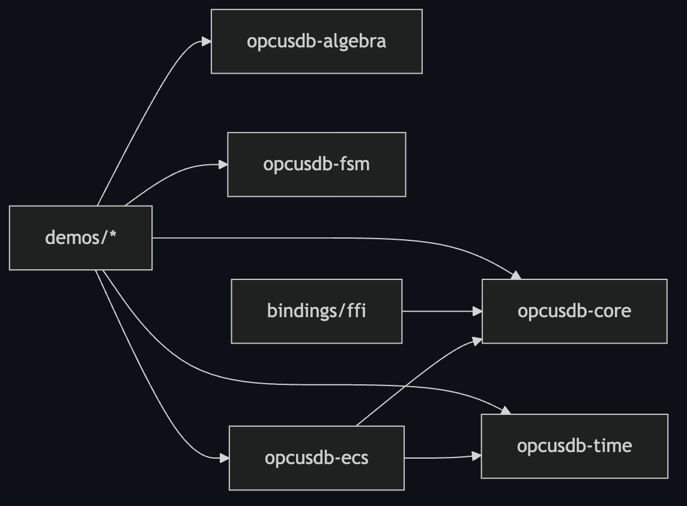</div>

## How determinism powers everything

<div align="center">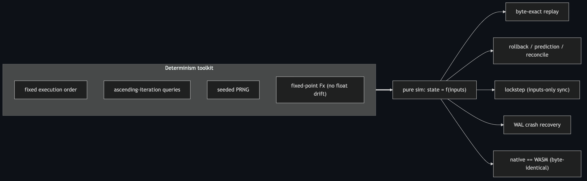</div>

### Mechanism: client prediction & server reconciliation

<div align="center">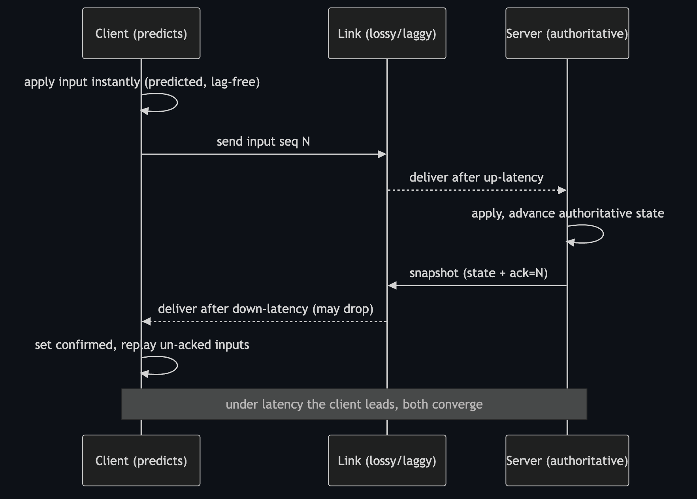</div>

> Diagram sources live in [`assets/diagrams/`](assets/diagrams/) (`*.mmd`).

## Crate map

| Crate | What it is |
|---|---|
| `opcusdb-core` | ECS: generational entities, sparse-set storage, **snapshot-able `World`**, deterministic queries (joins / exclusion / pick-smallest / `for_each_mut`), command buffer, **system scheduler**, **spatial grid (AOI)**, change-detection + memoized **`select`**, **PRNG**, **fixed-point `Fx`** |
| `opcusdb-algebra` | the functional sync algebra — `reduce` · `merge` · `select` · `query` · `fold` — and CRDTs (`LwwReg`, `GCounter`, `PNCounter`, `OrSet`, `Rga`) with law-checkers |
| `opcusdb-time` | the **Timeline**: fixed-timestep loop, keyframe ring, **rollback / scrub / replay**, deterministic timers |
| `opcusdb-fsm` | hierarchical + parallel **statechart** engine (SCXML-class) |
| `opcusdb-ecs` | bridge: run an ECS `World` as a Timeline `Sim` (rollback/replay for ECS games) |
| `bindings/ffi` | one minimal **C-ABI** over the sims → **WASM** (browser) and **native** (Unity/Godot/C); no `wasm-bindgen` |
| `demos/server` | eleven authoritative servers over a **hand-rolled WebSocket** (dependency-free): a shared-world game, a **human/AI chatroom** (OpenRouter via `curl`), **Gomoku**, **Arena** (snake), **Smackdown** (platform fighter), **Boomborn** (Vampire-Survivors-style horde survivor), **Townfall** (Godot 4 3D MMO town), **Overlode** (Overwatch-style FPS, lag-compensated), **Co-Board** (CRDT vector canvas), and **Rampart** (tower defense) — with rooms, leaderboards, physics, quests, and AI |

## The five game types → demos

| DESIGN target | Demo | Run | Shows |
|---|---|---|---|
| **WoW** (persistent + AOI) | `load-test` | `cargo run --release -p opcusdb-loadtest --bin loadtest` | many-entity ECS swarm + spatial-grid **interest sets** |
| **Overwatch** (room, predict/reconcile) | `netcode` | `cargo run -p opcusdb-netcode --bin cooldown` | **prediction / reconciliation** over a simulated laggy link + **WAL recovery** |
| **LoL** (lockstep) | `lockstep` | `cargo run -p opcusdb-lockstep --bin lockstep` | deterministic **inputs-only** fixed-point sim; peers stay byte-identical |
| **state machines** | `fsm-lab` | `cargo run -p opcusdb-fsm-lab --bin fsm-lab` | traffic intersection + quest graph; `run`/`record`/`replay`/`scrub` |
| **human + AI chat** | `chatroom` | `cargo run -p opcusdb-chatroom --bin chatroom` | serverless **CRDT mesh** (`Rga` + `OrSet`), offline-merge, **AI agent as a peer** |
| *(bonus)* | `particles` | browser | interactive fixed-point particle galaxy |
| **real multiplayer** | `server` (game) | `cargo run -p opcusdb-server` → open :9001 in 2+ tabs | **authoritative ECS server + WebSocket**; many browsers share one live world |
| **live human + AI chat** | `server` (chat) | `OPENROUTER_API_KEY=… cargo run -p opcusdb-server --bin opcusdb-chat` → :9002 | IRC-style channel; anyone logs in; **10 AI chatters via OpenRouter** |
| **Gomoku (5-in-a-row)** | `server` (gomoku) | `cargo run -p opcusdb-server --bin opcusdb-gomoku` → :9004 | turn-based **five-in-a-row**; rooms; win detection; persistent win leaderboard |
| **platform fighter** | `server` (smash) | `cargo run -p opcusdb-server --bin opcusdb-smash` → :9005 | Smash-style brawl; auto-join; arrows + Z/X; damage % + KOs; pixel fighters, parallax, particles, sound |
| **survivor (Vampire-Survivors-like)** | `server` (survivors) | `cargo run -p opcusdb-server --bin opcusdb-survivors` → :9006 | co-op bomberman vs vampire hordes; auto-bombs, XP/levels, waves, kills leaderboard |
| **3D MMO town (Godot)** | `server` (wow) + `demos/godot-wow` | `cargo run -p opcusdb-server --bin opcusdb-wow` → :9007, open the Godot project | NPC quests, wolves, chat; multiplayer 3D town in **Godot 4** |
| **FPS (Overwatch-like)** | `server` (ow) + Three.js | `cargo run -p opcusdb-server --bin opcusdb-ow` → :9008 | Tracer hero, lag-compensated hitscan, Blink/Recall, AI bots |
| **collaborative whiteboard (CRDT)** | `server` (board) | `cargo run -p opcusdb-server --bin opcusdb-board` → :9009 | vector editor (shapes/text/notes, resize handles); OrSet CRDT; offline-merge; presence |
| **tower defense** | `server` (td) | `cargo run -p opcusdb-server --bin opcusdb-td` → :9010 | path waves, Arrow/Cannon/Frost towers, call-wave-early, co-op rooms (?room=CODE); click-only |
| **AI town (agents)** | `server` (town) | `OPENROUTER_API_KEY=… cargo run -p opcusdb-server --bin opcusdb-town` → :9011 | 12 AI residents on AOI; embodied human visitors; PixiJS |
| **multiplayer game (snake)** | `server` (arena) | `cargo run -p opcusdb-server --bin opcusdb-arena` → :9003 | **rooms + rules + score + persistent leaderboard** (local DB file) |

## Quick start

```sh
# build + test everything
cargo test --workspace

# REAL multiplayer: authoritative server; open http://localhost:9001 in 2+ tabs
cargo run -p opcusdb-server

# local (single-tab) browser demos (WASM core + PixiJS): swarm/AOI, particles, netcode
bash bindings/ffi/build.sh
cd bindings/ffi/web && python3 -m http.server 8080   # open http://localhost:8080

# prove the native and WASM builds are byte-identical
bash bindings/ffi/determinism_gate.sh
# native (Rust): 0xcd8d89b3520fccd1
# wasm   (node): 0xcd8d89b3520fccd1
# DETERMINISM GATE: PASS (byte-identical across targets)
```

Native **Unity / Godot** bindings (same C-ABI): see [`bindings/ffi/native/`](bindings/ffi/native/).

## Test cases — what's actually proven

`cargo test --workspace` → **158 passing across 34 binaries**, clippy-clean. A selection:

| Property proven | Test |
|---|---|
| `World` snapshot is a deep, independent copy | `core … snapshot_is_a_deep_independent_copy` |
| Joins pick the smallest store and stay correct | `core … pick_smallest_store_join_is_correct` |
| Independent systems commute (parallel-safe) | `core … reordering_independent_systems_is_equivalent` |
| Spatial AOI matches brute force (1000s of entities) | `core … aabb_matches_brute_force` / `radius_matches_brute_force` |
| `select` recomputes only when a dependency changes | `core … memoizes_until_a_dependency_changes` |
| Fixed-point bits are identical everywhere | `core … deterministic_known_bits` |
| CRDTs obey the lattice laws + converge | `algebra … *_laws_*`, `orset_add_wins_and_converges`, `concurrent_inserts_converge` |
| Rollback + re-sim reproduces state exactly | `time … rollback_then_resim_reproduces` |
| Seek works after keyframe eviction | `time … seek_to_zero_works_after_keyframe_eviction` |
| Parallel statechart regions transition together | `fsm … parallel_regions_transition_simultaneously` |
| ECS sim gets rollback/replay (3000 entities) | `load-test … swarm_replay_and_rollback_at_scale` |
| Intersection never shows crossing greens | `fsm-lab … safety_invariant_never_two_go_axes` |
| Chat peers converge after an offline partition | `chatroom … all_peers_converge_after_partition` |
| Late input rolled back == on-time | `netcode … reconcile_late_input_matches_on_time` |
| Converges despite 60% snapshot loss | `netcode … converges_despite_snapshot_loss` |
| State survives a crash (WAL replay) | `netcode … recovers_exact_state_after_crash` |
| Two lockstep peers stay byte-identical | `lockstep … two_peers_stay_in_perfect_sync` |
| Shared world holds every connected player + spawns | `server … shared_world_holds_all_players_and_spawns` |
| WebSocket handshake (SHA-1/base64) per RFC 6455 | `server … rfc6455_accept_example` |
| Gomoku detects horizontal/diagonal five-in-a-row | `server … detects_horizontal_five`, `detects_diagonal_five` |
| Fighter attack hits in front, knockback & KO credit | `server … attack_in_front_damages_and_knocks_back`, `falling_into_blast_zone_kos_and_credits_last_hitter` |
| Survivor: explosion kills + xp drop, enemy AI, level-up | `server … explosion_kills_enemy_drops_gem_and_scores`, `enemy_moves_toward_player`, `level_up_grants_weapon_or_upgrade` |
| Townfall: wolf kill advances quest, NPC interact, wolf bite | `server … attack_kills_wolf_and_advances_quest`, `interact_accepts_quest_near_npc`, `wolf_bites_player_when_adjacent` |
| FPS: lag-compensated hit, no friendly fire, Recall rewind, Blink | `server … lag_comp_hits_a_target_directly_ahead`, `no_friendly_fire`, `recall_restores_past_position` |
| Co-Board: concurrent CRDT adds survive, offline stroke merges, clear | `server … concurrent_adds_all_survive_and_erase_removes_one`, `late_offline_stroke_merges_after_an_erase` |
| Tower defense: towers kill creeps for bounty, builds reject the path, leaks cost lives, waves advance | `server … a_tower_kills_a_creep_and_pays_bounty`, `placing_a_tower_costs_gold_and_rejects_the_road` |
| AI town: midday schedule, co-located scene + speaker, human line marks pending | `server … schedule_sends_everyone_to_the_market_at_midday`, `co_located_characters_form_a_scene_with_a_speaker` |
| Snake eats/grows; wall-crash records score | `server … snake_moves_and_eats`, `wall_collision_kills_and_records_score` |

## Status

The core and the five-game-types thesis are **complete and verified**, and
`opcusdb-server` adds **real client/server multiplayer over WebSocket**.
Still open as explicit, dependency-affecting choices: **WebRTC / QUIC** (for
browser P2P meshes and lower-latency datagrams), client-side prediction wired to
the live server (the logic exists in `demos/netcode`), multi-threaded
scheduler-stage execution (needs encapsulated `unsafe` World-splitting), and an
on-disk serializer (`rkyv`/`bitcode`). The workspace is `unsafe`-free outside the
FFI shim and has **zero external dependencies**.

## Documentation

- [`DESIGN.md`](DESIGN.md) — vision/architecture (the policy model, Timeline, sync algebra, topologies).
- [`CORE_SPEC.md`](CORE_SPEC.md) — buildable engineering spec for the core.
- [`PLAN.md`](PLAN.md) — original research survey (open-source real-time DBs) + language rationale.
- Each demo has its own README.

## License

[MIT](LICENSE).
