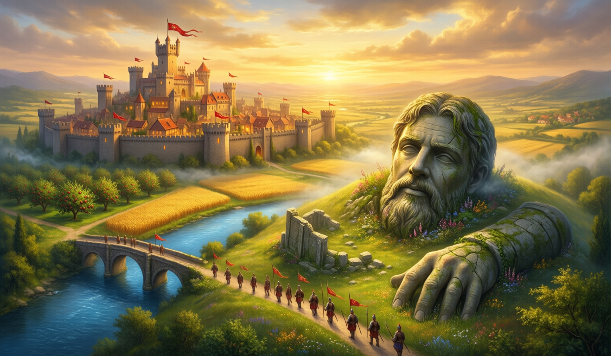

# Giantsreach

A complete, production-quality browser strategy MMO in the Travian / Clash of Kings / Rise of Kingdoms tradition. Raise a hold among the fallen stone giants, grow your economy on time-based timers, train a host, march on the barbarian camps, climb the realm ladder, and band your banner with others.

The whole game is a single dependency-free Node.js server plus a static web client. The runtime is fully deterministic and server-authoritative. There are no third-party packages, no build step, and no AI calls at runtime.



## Run it

```sh
./launch.sh
```

That starts the server on `http://localhost:8787` and opens the browser. To choose a port:

```sh
PORT=9000 ./launch.sh
```

Or run the server directly:

```sh
node server/server.js
```

Requirements: Node.js (any modern version). Nothing to install.

## What is in it

- User registration and login (scrypt-hashed passwords) plus one-tap guest play.
- Time-based construction, training, and march timers that resolve lazily and deterministically, so they keep ticking correctly across server restarts and while you are offline.
- A resource economy (grain, timber, stone, iron, gold) with storage caps, grounded in Travian/RoK formulas.
- Structure upgrades with painterly building art, an interactive pannable/zoomable home town with tappable buildings.
- A big world map of barbarian camps and rival cities, marches, and a deterministic mixed-arms combat resolver with win/lose battle reports.
- Equipment and a hero: a deterministic Forge gacha with a transparent pity counter; relics buff combat, loot, and march speed.
- A full retention suite: a 7-day login calendar, a daily task ladder with reward chests, a free timed chest, permanent tiered achievements, a VIP track, and a 30-day season pass with free and gold tracks.
- Alliances ("banners"): create/join, a roster, the signature timer-shaving help, a production bonus, and a War Table chat.
- A monetization-style shop. Purchases are SIMULATED: "buying" simply grants shards, with no payment of any kind.
- Acceleration/speedups: finish timers instantly with shards on a Clash-style gem-to-time curve, or free under five minutes.
- A splash/title screen, a game tutorial, procedural audio (ambient music + SFX, muted until the first click), animations, and a voice for the realm: barbarian taunts, battle narration, a steward's counsel, and a lore codex, all baked offline.

## Architecture

```
giantsreach/
  server/server.js   the authoritative game server (http, crypto, fs only)
  web/               the static client (index.html, game.js, audio.js, style.css)
  web/img/           baked painterly art (splash, city, building icons)
  db/db.json         JSON persistence (created on first run)
  launch.sh          start script
  GAME.md            full design doc, locked art direction, and build log
```

- Server-authoritative: the client never computes outcomes; it sends intents and renders the snapshot the server returns from `/api/state`. The client only interpolates resource counters smoothly between syncs.
- Deterministic and lazy: all time-based state (builds, training, marches, resources, seasons) is resolved from timestamps on read, so it survives restarts and offline gaps with no background tick loop.
- No runtime AI: every "AI" element (art, flavor text) is baked offline into static assets and served by seed. The server never calls an external service.

## Hardening

- Atomic, durable saves: the database is written to a temp file, the previous file is backed up to `db.json.bak`, then renamed into place, so a crash mid-write cannot corrupt it. On boot the server falls back to the backup if the main file is unreadable.
- Graceful shutdown: SIGINT/SIGTERM and uncaught exceptions flush the pending save before exit.
- A per-IP sliding-window rate limit on the API, request-size and URL-length caps, method allow-listing, and static-path-traversal protection.
- Input validation on every route (bounded numerics, name/tag patterns, JSON body cap).

## Offline asset baking

Art is baked offline with Qwen-Image via ComfyUI on a slow high-quality pass (no Lightning LoRA, ~24-26 steps, cfg 3.5) in the locked painterly style. Audio is procedural Web Audio (a generative ambient bed plus synthesized SFX), created on the first user gesture and muted until then. None of this runs at game time; the runtime only serves the static results.

## Notes

- One server / one realm.
- Purchases are simulated. No real money is ever involved.
- No em-dashes anywhere in the code or docs, by project convention.

See `GAME.md` for the full design, the locked art direction, the grounded systems spec, and the iteration-by-iteration build log.
